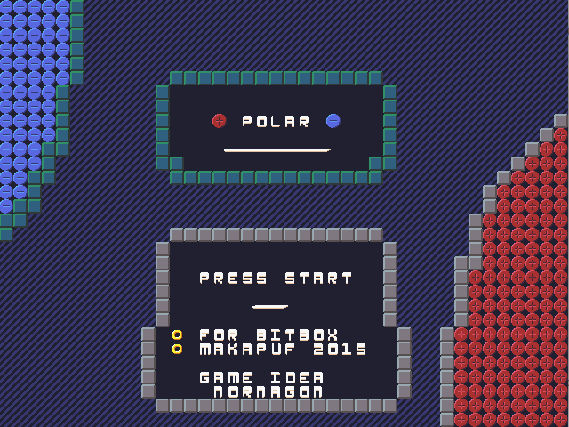
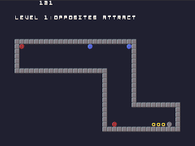
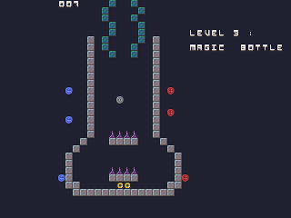

Polar
======

Polar is a game for Bitbox where you are a particle and you can change your polarity to go through mazes.

[The Bitbox console](http://bitboxconsole.blogspot.com)

Inspiration
-----------
This game has been inspired by *Polarity*, a game written for ludum dare 23 by nornagon

 http://nornagon.net/games/polarity/
 https://github.com/nornagon/polarity

Credits
-------

This game (code, GFX, sounds) is (c) Makapuf 2015, written in a day for the Bitbox Console

Code is 200 lines of C
Tools used : gimp, tiled, C editor, bitbox SDK

TODO
----

small anims (intro : up/dn,loose : ejecte, win : ascend, chage color : flash sprite) ? (avec sprite)

transition between screens : diagonal animation/transition  change of tiles
alternating poles ?

sound / SfX ! 
cache charges lvl pour + rapide  
intermediary text levels / animation intro 
more levels 

